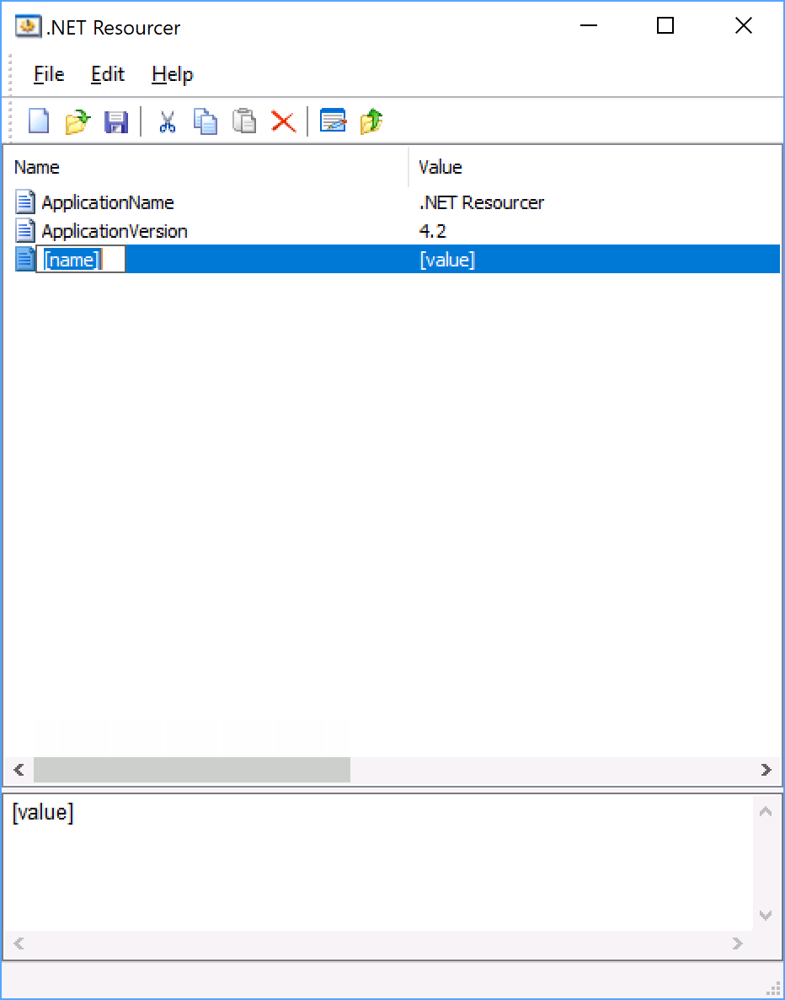

# .NET Resourcer

Resourcer is an editor for .resources and .resx files used with the .NET platform.

Resourcer allows editing of strings, import of bitmaps and merging of resources from different sources.

